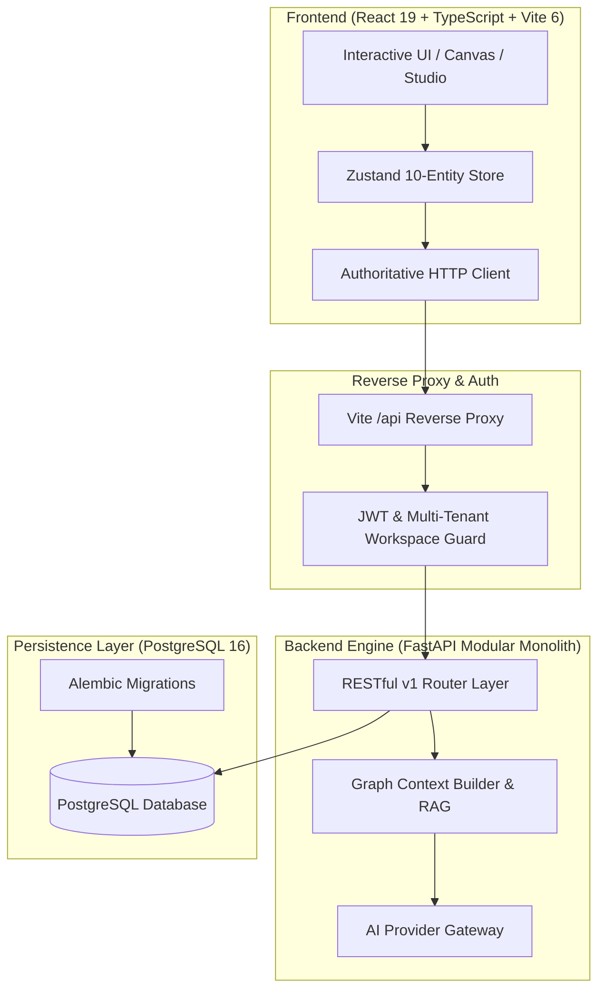

<div align="center">

# 🔬 ResearchOS

### *The Operating System for Evidence-Backed Scientific Reasoning, Automated Provenance & Publication*

[](https://github.com/Vishaldave45/research-os/releases)
[](LICENSE)
[](https://fastapi.tiangolo.com)
[](https://react.dev)
[](https://docs.pytest.org)

<p align="center">
  <b>ResearchOS</b> is an enterprise-grade, open-source scientific reasoning environment that bridges literature analysis, hypothesis generation, empirical experiment tracking, and IEEEtran publication workflows into a single deterministic <b>Knowledge Directed Acyclic Graph (DAG)</b>.
</p>

---

[Key Features](#-key-features) • [Architecture](#-system-architecture) • [Getting Started](#-getting-started) • [10-Archetype DAG](#-10-archetype-dag-ontology) • [AI Copilot & RAG](#-ai-research-copilot--grounded-rag) • [PublicationOS](#-publicationos--camera-ready-export) • [Testing](#-testing--quality-gates)

---

</div>

## 🌟 Key Features

<table>
  <tr>
    <td width="50%">
      <h3>🕸️ Interactive Spatial Graph</h3>
      <p>Multi-directional DAG powered by <code>@xyflow/react</code> with strict semantic ontology validation, real-time cycle detection, and multi-tenant workspace isolation.</p>
    </td>
    <td width="50%">
      <h3>🔍 Deep Backward Provenance</h3>
      <p>Recursively trace scientific claims and decisions back through empirical experiments, MLflow runs, datasets, and literature citations to their originating root questions.</p>
    </td>
  </tr>
  <tr>
    <td width="50%">
      <h3>🤝 CollaborationOS</h3>
      <p>Threaded multi-tenant discussions, one-click peer review verification verdicts (<code>approve</code> / <code>changes_requested</code>), and tamper-evident audit logs directly in the Node Inspector.</p>
    </td>
    <td width="50%">
      <h3>🤖 Grounded AI Copilot & RAG</h3>
      <p>Provider-agnostic LLM gateway (Gemini, OpenAI, Claude, Local) that builds authorized graph context from PostgreSQL and generates answers with explicit entity citations (<code>[P-001]</code>, <code>[H-001]</code>, <code>[R-001]</code>).</p>
    </td>
  </tr>
  <tr>
    <td width="50%">
      <h3>🔌 External Multi-Source Adapters</h3>
      <p>Native connectors for <b>BibTeX / Zotero</b> reference imports, <b>MLflow</b> benchmark metric telemetry sync, and <b>GitHub</b> VCS commit SHA verification.</p>
    </td>
    <td width="50%">
      <h3>📄 PublicationOS Studio</h3>
      <p>Live camera-ready two-column studio, Markdown draft composer, and one-click export of <b>IEEEtran LaTeX (<code>.tex</code>)</b>, <b>BibTeX (<code>.bib</code>)</b>, and <b>Evidence Traceability Matrices</b>.</p>
    </td>
  </tr>
</table>

---

## 🏛️ System Architecture



---

## 🧩 10-Archetype DAG Ontology

ResearchOS enforces strict semantic causality across 10 specialized entity archetypes:

```
[Research Question] ➔ [Literature Paper] ➔ [Evidence Item] ➔ [Literature Gap]
        │                                                          │
        ▼                                                          ▼
  [Dataset / Model] ────────────────────────────────────────> [Hypothesis]
        │                                                          │
        ▼                                                          ▼
 [MLflow Telemetry] ────────────────────────────────────────> [Experiment]
                                                                   │
                                                                   ▼
  [Claim / Decision] <──────────────────────────────────────── [Result]
```

---

## 🚀 Getting Started

### Prerequisites
- **Node.js**: `v20.x` or `v22.x`
- **Python**: `3.11+` or `3.12+`
- **PostgreSQL**: `16` (or Docker Compose)

### 1. Clone & Set Up Environment
```bash
git clone https://github.com/Vishaldave45/research-os.git
cd research-os
```

### 2. Launch Backend (FastAPI + PostgreSQL)
```bash
cd backend
python3 -m venv .venv
source .venv/bin/activate
pip install -r requirements.txt

# Run migrations & seed data
alembic upgrade head
python seed_data.py

# Start FastAPI server
uvicorn app.main:app --host 0.0.0.0 --port 8000 --reload
```

### 3. Launch Frontend (React 19 + Vite)
```bash
# In the root repository directory
npm install
npm run dev
```
Open **`http://localhost:3000`** in your browser to access ResearchOS.

---

## 🧪 Testing & Quality Gates

ResearchOS maintains full test coverage across both the backend persistence layer and frontend state engine:

### Backend Automated Test Suite
```bash
cd backend
pytest -v
# 34 / 34 Pytest Suites Passing (PostgreSQL 16 E2E, Isolation, AI Gateway, Manuscript Export)
```

### Frontend Unit & Component Tests
```bash
npm test
# 6 / 6 Vitest Suites Passing (Ontology Rules, Cycle Detection, DAG State Store)
```

### Production Build & Linting
```bash
npm run lint    # TypeScript typecheck
npm run build   # Production Vite bundle compilation
```

---

## 🗺️ Milestone Roadmap

- [x] **v0.1.0 Foundation**: PostgreSQL schema, Alembic migrations, JWT auth, and multi-tenant workspace isolation.
- [x] **v0.2.0 Research Core**: 10-Entity DAG, visual linking, and semantic ontology constraints.
- [x] **v0.3.0 Lineage & Traceability**: Recursive backward provenance graph traversal.
- [x] **v0.4.0 CollaborationOS**: Threaded comments, peer review approvals, and immutable audit logging.
- [x] **v0.5.0 Integrations**: External adapters for BibTeX/Zotero, MLflow, and GitHub VCS.
- [x] **v0.6.0 AI Research Copilot**: Provider-agnostic LLM gateway (Gemini, Local) and graph context builder.
- [x] **v0.7.0 PublicationOS**: Manuscript composer, IEEEtran LaTeX compilation, and Evidence Traceability Matrix.
- [x] **v1.0.0 Production Release**: Enterprise-grade multi-domain scientific OS.

---

## 📄 License

Distributed under the **MIT License**. See [`LICENSE`](LICENSE) for more information.

<div align="center">
  <sub>Built with ❤️ for researchers, scientists, and machine learning engineers worldwide.</sub>
</div>
