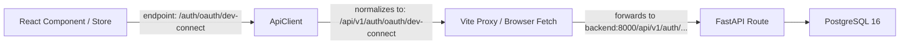

# ResearchOS API Routing & URL Architecture Audit

**Audit Date**: 2026-08-31  
**Scope**: Centralized API Base URL, Vite Development Proxy, and Frontend/Backend Route Consistency.

---

## 1. Root Cause Analysis
- **Observed Error**: `POST http://localhost:8000/auth/oauth/dev-connect -> 404 Not Found (HTML)`
- **Mechanism**:
  - In `src/services/api/client.ts`, line 111 previously checked `if (endpoint.startsWith('/auth'))` and left `/auth/...` un-prefixed without `/api/v1`.
  - Vite's proxy forwards `/auth` directly to `http://localhost:8000/auth/...`.
  - However, FastAPI registers authentication routers under `settings.API_V1_STR` (`/api/v1/auth/...`).
  - As a result, the request bypassed the `/api/v1` namespace and hit a nonexistent route at `http://localhost:8000/auth/oauth/dev-connect`, generating a 404 response.

---

## 2. Centralized Architecture & Fix
All frontend requests flow strictly through a unified endpoint normalizer in `client.ts`:

### URL Normalization Rules:
1. `/health` & `/ready` ➔ Left untouched (FastAPI root level probes).
2. `/auth/oauth/popup-callback` ➔ Left untouched (FastAPI root HTML callback page).
3. Any other route (e.g. `/auth/login`, `/questions`, `/workspaces`) ➔ Automatically normalized with `/api/v1` prefix.
4. If backend returns an HTML 404/500, `client.ts` intercepts the HTML body and produces a structured user error message: `API endpoint error (404): METHOD /api/v1/... - Not Found`.

---

## 3. Comprehensive Route Audit Matrix

| Domain | Frontend Call | Authoritative Backend Route | Status |
| :--- | :--- | :--- | :---: |
| **Auth Login** | `/auth/login` | `POST /api/v1/auth/login` | ✅ **SYNCHRONIZED** |
| **Auth Register** | `/auth/register` | `POST /api/v1/auth/register` | ✅ **SYNCHRONIZED** |
| **Auth Refresh** | `/auth/refresh` | `POST /api/v1/auth/refresh` | ✅ **SYNCHRONIZED** |
| **Auth Logout** | `/auth/logout` | `POST /api/v1/auth/logout` | ✅ **SYNCHRONIZED** |
| **Auth Me** | `/auth/me` | `GET /api/v1/auth/me` | ✅ **SYNCHRONIZED** |
| **OAuth Connect**| `/auth/oauth/dev-connect` | `POST /api/v1/auth/oauth/dev-connect` | ✅ **SYNCHRONIZED** |
| **OAuth URL** | `/auth/oauth/{p}/url` | `GET /api/v1/auth/oauth/{p}/url` | ✅ **SYNCHRONIZED** |
| **Workspaces** | `/workspaces` | `GET/POST /api/v1/workspaces` | ✅ **SYNCHRONIZED** |
| **Projects** | `/workspaces/{id}/projects`| `GET/POST /api/v1/workspaces/{id}/projects` | ✅ **SYNCHRONIZED** |
| **Questions** | `/questions` | `GET/POST /api/v1/questions` | ✅ **SYNCHRONIZED** |
| **Papers** | `/papers` | `GET/POST /api/v1/papers` | ✅ **SYNCHRONIZED** |
| **Evidence** | `/evidence` | `GET/POST /api/v1/evidence` | ✅ **SYNCHRONIZED** |
| **Datasets** | `/datasets` | `GET/POST /api/v1/datasets` | ✅ **SYNCHRONIZED** |
| **Models** | `/models` | `GET/POST /api/v1/models` | ✅ **SYNCHRONIZED** |
| **Gaps** | `/gaps` | `GET/POST /api/v1/gaps` | ✅ **SYNCHRONIZED** |
| **Hypotheses** | `/hypotheses` | `GET/POST /api/v1/hypotheses` | ✅ **SYNCHRONIZED** |
| **Experiments** | `/experiments` | `GET/POST /api/v1/experiments` | ✅ **SYNCHRONIZED** |
| **Results** | `/results` | `GET/POST /api/v1/results` | ✅ **SYNCHRONIZED** |
| **Decisions** | `/decisions` | `GET/POST /api/v1/decisions` | ✅ **SYNCHRONIZED** |
| **Claims** | `/claims` | `GET/POST /api/v1/claims` | ✅ **SYNCHRONIZED** |
| **Lineage Trace**| `/decisions/{id}/trace` | `GET /api/v1/decisions/{id}/trace` | ✅ **SYNCHRONIZED** |
| **AI Copilot** | `/ai/copilot/query` | `POST /api/v1/ai/copilot/query` | ✅ **SYNCHRONIZED** |
| **Integrations** | `/integrations/...` | `POST /api/v1/integrations/...` | ✅ **SYNCHRONIZED** |
| **Manuscripts** | `/manuscript/...` | `POST /api/v1/manuscript/...` | ✅ **SYNCHRONIZED** |
